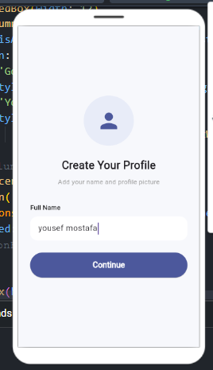
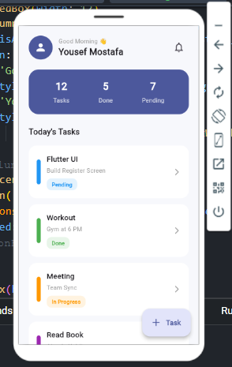
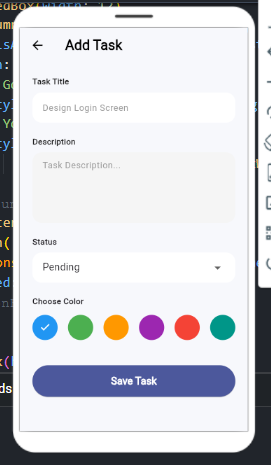

# Taskati ✅ — Task Management App


Taskati is a simple, clean task management app built with Flutter. Create a profile, add tasks with color-coded categories, and track your progress from a daily dashboard.

---

## 📱 Screenshots

<p align="center">
  
  &nbsp;&nbsp;
  
  &nbsp;&nbsp;
  
</p>

## 📱 Features

| Area | Description |
|---|---|
| **Profile Setup** | Create a profile with your name on first launch |
| **Daily Dashboard** | Greeting header with total, done, and pending task counts |
| **Today's Tasks** | List of tasks with category, status, and quick access |
| **Add Task** | Title, description, status (e.g. Pending), and a color tag |
| **Status Tracking** | Tasks marked as Pending, In Progress, or Done |
| **Color Coding** | Assign a color to each task for quick visual grouping |

## 🛠️ Tech Stack

| Category | Technology |
|---|---|
| Framework | Flutter |
| Language | Dart |
| Built with | [FlutLab](https://flutlab.io) — Flutter Online IDE |

## Getting Started

```bash
# Clone the repository
git clone https://github.com/22ousefmostafa/Taskati.git
cd Taskati

# Install dependencies
flutter pub get

# Run the app
flutter run
```

## Author

Built by [Youssef Mostafa](https://github.com/22ousefmostafa).

## License

This project is currently unlicensed.
